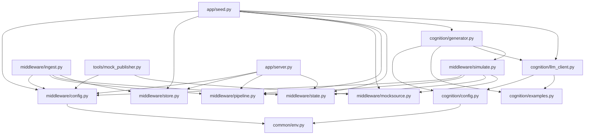

# DATAFLOW.md — 實作資料流與演算法 (L2 → L3 → App)

本檔記錄**目前實際程式碼**的端到端資料流：型別演變、函數相依關係、數值轉換演算法、關鍵參數。
高層脈絡見 [CLAUDE.md](CLAUDE.md)，介面合約見 [docs/SPEC.md](docs/SPEC.md)。L1（韌體）尚未實作，目前以模擬替代。

---

## 0. 四個進入點 (Entry Points)

| 指令 | 路徑 | 用途 |
|---|---|---|
| `python -m middleware.simulate` | L2 離線 | 模擬 L1 → 算狀態，純印出（記憶體，不落 DB） |
| `python -m middleware.ingest` + `python -m tools.mock_publisher` | L2 即時 | MQTT 收 telemetry → 落 DB → 算狀態 → 回發 |
| `python -m cognition.generator --demo` | L2→L3 | 狀態 → LLM → 幽默日記 |
| `python -m app.seed` → `python -m app.server` | 全鏈→展示 | 落 DB（含日記）→ 網頁呈現 |

資料**單向**流動：`telemetry → stats → state packet → diary`，各階段型別固定（見 §1）。

---

## 1. 端到端資料流（型別演變）

```
 ┌────────── L1（模擬）──────────┐   ┌──────── L2 中介 ────────┐   ┌────── L3 認知 ──────┐   ┌─ App ─┐
 mocksource.generate()           store/in-mem    compute_stats()   build_state_packet()  generate_diary()   server
        │                            │                  │                  │                   │             │
        ▼                            ▼                  ▼                  ▼                   ▼             ▼
   (1) telemetry  ───────────►  (落地/視窗)  ──►  (2) stats  ──────►  (3) state packet ─►  (4) diary  ──►  網頁
```

**(1) telemetry**（L1→L2，符合 [contracts/telemetry.schema.json](contracts/telemetry.schema.json)）
```json
{ "node":"plant_01", "ts":1730000000,
  "moisture_raw":2850, "light_raw":1980,
  "temp_c":28.5, "humidity_pct":61.2, "sim":true }
```
`*_raw` 為 0–4095 的 ADC 原始值；溫濕度為 BME280 物理量；`sim` 標記模擬資料。

**(2) stats**（`pipeline.compute_stats()` 產出 — 把陣列萃取成統計摘要）
```json
{ "moisture_pct":18.0, "moisture_diff_1h":-3.2, "temp_c":28.5,
  "humidity_pct":55.0, "light_pct":60.0, "n_samples":60, "sim":true }
```

**(3) state packet**（`state.build_state_packet()`，符合 [contracts/state_packet.schema.json](contracts/state_packet.schema.json)）
```json
{ "node":"plant_01", "ts":1730000000, "state":"CRITICAL_DROUGHT", "stats":{...如上...} }
```

**(4) diary**（`cognition.generator.generate_diary()` 產出）
```json
{ "node":"plant_01", "ts":1730000000, "state":"CRITICAL_DROUGHT",
  "diary":"（第一人稱、幽默、≤120 字）" }
```

關鍵設計：**LLM 不碰原始數字**。所有「<20%」「>30」的判斷都在 L2 完成（步驟 2→3），L3 只依 `state` + `stats` 寫字。

---

## 2. 函數相依關係（呼叫鏈）

### 路徑 A — 離線管線 `python -m middleware.simulate`
```
simulate.main()
└─ simulate.run(n, dt)
   └─ simulate.iter_packets(n, dt)              # generator，L3 也重用這支
      ├─ pipeline.load_calibration(CALIBRATION_PATH)
      ├─ mocksource.generate(n, dt)             # → list[telemetry]
      └─ 對每筆：
         ├─ (取最近視窗 window)
         ├─ pipeline.compute_stats(window, calib, DIFF_WINDOW_SEC, SMOOTH_SAMPLES)  # → stats
         └─ state.build_state_packet(node, ts, stats)                               # → state packet
```

### 路徑 B — MQTT 即時
```
tools.mock_publisher.main()                     # 發布端
└─ mocksource.stream() ─(MQTT publish JSON)─► topic plants/{node}/telemetry

middleware.ingest.main()                        # 接收端
└─ on_message(msg)
   └─ ingest.handle_payload(conn, calib, payload, publish)
      ├─ json.loads(payload)
      ├─ store.insert(conn, rec)                # 落地 SQLite
      ├─ store.recent(conn, node, since)        # 取回看視窗
      ├─ pipeline.compute_stats(window, calib)  # → stats
      ├─ state.build_state_packet(...)          # → state packet
      └─ publish(STATE_TOPIC_FMT, pkt)          # 回發 plants/{node}/state
```

### 路徑 C — 認知生成 `python -m cognition.generator`
```
generator.main()
├─ get_client(provider)                          # → Stub / OpenAICompatible（gemini/openai/ollama）
├─ (--demo) middleware.simulate.iter_packets()   # 重用 L2 產 state packet
└─ generator.generate_diary(packet, client)
   ├─ generator.load_persona()                   # 讀 prompts/persona.md
   ├─ client.generate(packet, system=persona, few_shot=FEW_SHOT)
   │    • StubLLMClient：examples.STUB_TEMPLATES[state] → _stat_fmt 填數字
   │    • OpenAICompatibleClient：messages=[system, few-shot…, _grounding(packet)] → chat.completions
   └─ generator.postprocess(raw, MAX_CHARS)      # 去違規字 + 截斷 → diary
```

### 路徑 D — 展示 `python -m app.seed` → `python -m app.server`
```
app.seed.run(provider, …)
├─ store.connect(DB_PATH)  ├─ pipeline.load_calibration  ├─ get_client(provider)
├─ mocksource.generate(n, dt)
└─ 對每筆：
   ├─ store.insert(conn, rec)                                   # telemetry 表
   ├─ pipeline.compute_stats(window, calib) → state.build_state_packet
   └─ if state 改變: generator.generate_diary(pkt, client) → store.insert_diary(conn, diary)  # diaries 表

app.server.main()  →  ThreadingHTTPServer(Handler)
└─ Handler.do_GET
   ├─ "/"            → 回 PAGE（HTML；JS 每 5s fetch 下面兩個）
   ├─ "/api/state"   → _state_payload(): store.recent_by_count(60) → compute_stats → build_state_packet
   └─ "/api/diaries" → _diaries_payload(): store.recent_diaries()
```

---

## 3. 數值轉換演算法

### 3.1 土壤濕度：ADC → %（`pipeline.raw_to_moisture_pct`）
電容式感測器：**raw 越大代表越乾**。兩點線性校準（[middleware/calibration.json](middleware/calibration.json)）：
```
moisture_pct = clamp( (raw_dry - moisture_raw) / (raw_dry - raw_wet) × 100 , 0, 100 )
   raw_dry = 3000（空氣中/全乾）   raw_wet = 1300（泡水/全濕）
例：raw=2850 → (3000-2850)/(3000-1300)×100 = 150/1700×100 ≈ 8.8%
   raw=1300 → 100%   raw=3000 → 0%   超出範圍以 clamp 夾在 [0,100]
```
到貨後校準：把感測器①懸空、②插滿水各讀一個穩定 raw，分別填 `raw_dry`、`raw_wet` 即可，**L2/L3 程式不用改**。

### 3.2 光照：ADC → %（`pipeline.raw_to_light_pct`）
```
light_pct = clamp( (light_raw - raw_dark) / (raw_bright - raw_dark) × 100 , 0, 100 )
   raw_dark = 0   raw_bright = 4095
```

### 3.3 中位數濾波（`pipeline.median_filter`）
對一組樣本取中位數、忽略 NaN，用來去除突波（spike）。被 `compute_stats` 用於「目前值」與光照。
```
median_filter(values) = median( [v for v in values if not NaN] )
```

### 3.4 統計摘要（`pipeline.compute_stats`）— 核心
輸入：同一 node 的近期 telemetry 串列（依 `ts` 排序）。步驟：
```
1. 對每列算 moisture_pct（§3.1）、light_pct（§3.2，若有 light_raw）
2. now_ts        = 最新一筆的 ts
3. moisture_now  = median_filter( 最近 SMOOTH_SAMPLES(=5) 筆的 moisture_pct )   # 去殘餘突波
4. past          = 所有 ts ≤ now_ts − DIFF_WINDOW_SEC(=3600) 的列
   moisture_past = past 的「最後一筆」moisture_pct；若 past 為空 → 用「最早一筆」
5. moisture_diff_1h = moisture_now − moisture_past        # 正=變濕(可能澆水)，負=變乾
6. temp_c    = 最新一筆 temp_c
   light_pct = median_filter(最近 5 筆 light_pct)
   humidity_pct = 最新一筆
7. 全部 round 到小數 1 位；NaN → null
```
`moisture_diff_1h` 是「現在 vs 一小時前」，因此需要回看視窗有足夠歷史；資料不足時退化為「vs 最早一筆」。

### 3.5 狀態分類（`state.classify`）— 優先序 + 閾值
依**優先序**回傳單一主要狀態（前者命中即回傳）：
```
1. WATERING_DETECTED   if moisture_diff_1h ≥ 30           # 剛澆水（正向事件，最優先）
2. CRITICAL_DROUGHT    if moisture_pct < 20 且 diff < 0    # 低且仍在變乾
3. HEAT_STRESS         if temp_c > 30.0
4. LOW_LIGHT           if light_pct < 15                   # 選做
5. STABLE              （以上皆不符）
```
閾值集中於 `state.THRESHOLDS`，可用真實資料調校：

| 參數 | 值 | 意義 |
|---|---|---|
| `watering_rise_pct` | 30.0 | 1 小時濕度升幅門檻 |
| `drought_moisture_pct` | 20.0 | 乾旱濕度門檻 |
| `heat_temp_c` | 30.0 | 高溫門檻 |
| `low_light_pct` | 15.0 | 光照不足門檻 |

### 3.6 模擬資料生成模型（`mocksource.generate`）
產生「**穩定→變乾→澆水→午後熱浪**」劇本，讓五種狀態都至少出現一次。`n=240` 筆、每筆 `dt=300` 秒（模擬時間）。
```
濕度 moisture（起始 75%）：
   i < 0.70·n     : moisture −= 0.25 + 0.5·frac     # 緩慢變乾、中後段加速（frac=i/(n-1)）
   i == 0.70·n    : moisture += 55                  # 澆水：急升 → 觸發 WATERING
   i  > 0.70·n    : moisture −= 0.3
   moisture = clamp(moisture, 3, 98)
   moisture_raw = _moisture_pct_to_raw(moisture + 雜訊±1)        # §3.1 的反運算

溫度 temp：
   hours = (ts mod 86400)/3600
   temp  = 25 + 6·sin((hours−9)/24·2π) + 雜訊±0.5
   if 0.50 ≤ frac ≤ 0.60: temp += 6              # 熱浪 → 觸發 HEAT_STRESS
空氣濕度 humidity = clamp(70 − (temp−25)·2 + 雜訊±3, 20, 95)
光照 light_pct = max(0, sin((hours−6)/24·2π))·100 ;  light_raw = light_pct/100·4095
```
反運算 `_moisture_pct_to_raw(pct) = raw_dry − (pct/100)·(raw_dry − raw_wet)`（與 §3.1 互逆，確保 L2 校準回得到原 pct）。

### 3.7 Prompt 組裝（L3）
- **System**：[cognition/prompts/persona.md](cognition/prompts/persona.md)（第一人稱、傲嬌幽默、禁止自曝 AI、禁止虛構、≤120 字）。
- **Few-shot**：`examples.FEW_SHOT`（(狀態, 範例日記) 對，注入成 user/assistant 來回）。
- **情境注入**（`llm_client._grounding`）：
  ```
  今天的狀態是 {state}。感測數據：土壤濕度 {moisture_pct}%（過去一小時變化 {moisture_diff_1h}）、
  溫度 {temp_c}°C、空氣濕度 {humidity_pct}%、光照 {light_pct}%。請只根據這些數據，用你的人格寫一篇今天的日記。
  ```
- **Stub 離線**：不呼叫 API，從 `examples.STUB_TEMPLATES[state]` 隨機取一句模板，用 `_stat_fmt(stats)` 把 `{moisture}/{temp}/{light}` 換成真實數字。

### 3.8 日記後處理（`generator.postprocess`）
```
1. strip 前後空白
2. 移除違規字串（generator.BANNED：「我是一個 AI」「語言模型」「as an AI」…）
3. strip 前後標點（，、。空白換行）
4. 若長度 > MAX_CHARS(120)：
     在前 120 字內找最後一個句尾（。！？\n）
     若該位置 ≥ 120×0.6(=72) → 截到該句尾（保留完整句）
     否則 → 硬切到 120 字
```

---

## 4. 關鍵參數（`*/config.py`，皆可用環境變數覆寫）

| 參數 | 預設 | 來源/env | 影響 |
|---|---|---|---|
| `DIFF_WINDOW_SEC` | 3600 | middleware | `moisture_diff_1h` 回看視窗（秒） |
| `SMOOTH_SAMPLES` | 5 | middleware | 「目前值」取幾筆中位數 |
| `DB_PATH` | `middleware/data/telemetry.db` | `L2_DB_PATH` | SQLite 位置 |
| `CALIBRATION_PATH` | `middleware/calibration.json` | `CALIBRATION_PATH` | 校準檔 |
| `MQTT_HOST/PORT` | localhost / 1883 | `MQTT_HOST/PORT` | 即時路徑 broker |
| `PROVIDER` | `stub` | `LLM_PROVIDER` | stub/openai/ollama/gemini |
| `MODEL` | `gpt-4o-mini` | `LLM_MODEL` | 模型（gemini 預設 gemini-2.0-flash） |
| `TEMPERATURE` | 0.9 | `LLM_TEMPERATURE` | 生成隨機度 |
| `MAX_OUTPUT_TOKENS` | 1024 | `LLM_MAX_TOKENS` | 輸出上限（2.5 思考模型需給足） |
| `MAX_RETRIES` | 3 | `LLM_MAX_RETRIES` | 429/5xx 自動退避重試 |
| `MAX_CHARS` | 120 | `DIARY_MAX_CHARS` | 日記字數上限（postprocess） |

`.env`（repo 根目錄）由 [common/env.py](common/env.py) 在 config 載入時自動讀入（不需 python-dotenv）。

---

## 5. 模組相依圖（import 關係）


重點：
- **L3（cognition）重用 L2 的 `simulate.iter_packets`**（`--demo`）與整個 pipeline/state。
- **App 的 `seed` 串起 L2＋L3＋落 DB**；`server` 只依賴 L2（讀 DB + 即時算 stats），**不依賴 cognition**（日記已存在 DB）。
- `store` 不依賴 config 以外的東西；`pipeline`、`state` 為純函式、零 I/O（好測試）。

---

## 6. 函數索引（檔案 → 函數 → 職責）

| 檔案 | 函數 | 職責 |
|---|---|---|
| `middleware/pipeline.py` | `load_calibration` | 讀 calibration.json |
| | `raw_to_moisture_pct` / `raw_to_light_pct` | ADC→% 校準（§3.1/3.2） |
| | `median_filter` | 中位數去突波（§3.3） |
| | `compute_stats` | 陣列→統計摘要 stats（§3.4） |
| `middleware/state.py` | `classify` | stats→狀態標籤（§3.5） |
| | `build_state_packet` | 組 state packet |
| `middleware/store.py` | `connect`/`insert`/`recent`/`recent_by_count` | telemetry 落地與查詢 |
| | `insert_diary`/`recent_diaries`/`nodes` | 日記落地與查詢 |
| `middleware/mocksource.py` | `generate`/`stream` | 模擬 L1 telemetry（§3.6） |
| `middleware/simulate.py` | `iter_packets` | 模擬→state packet（被 L3 重用） |
| | `run`/`_fmt` | 離線印出 |
| `middleware/ingest.py` | `handle_payload` | MQTT 單筆處理（落地→狀態→回發） |
| `cognition/llm_client.py` | `get_client` | 依 provider 建 client |
| | `StubLLMClient.generate` | 離線模板生成 |
| | `OpenAICompatibleClient.generate` | 雲端/本機 LLM（OpenAI/Gemini/Ollama） |
| | `_grounding`/`_stat_fmt` | 情境注入 / 模板填值（§3.7） |
| `cognition/generator.py` | `generate_diary` | state packet→日記 |
| | `postprocess` | 去違規字+截斷（§3.8） |
| | `synthetic_packet`/`load_persona` | 測試用合成資料 / 載入人格 |
| `app/seed.py` | `run` | 模擬→落 DB（含日記） |
| `app/server.py` | `_state_payload`/`_diaries_payload` | 給網頁的 JSON |
| | `Handler.do_GET` | 路由 `/`、`/api/state`、`/api/diaries` |
